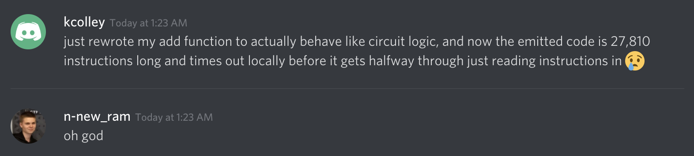

Hjarnknull [Misc 337, 7 solves]
==========

Hjarnknull is a challenge where you're given a Python script that's an emulator for a custom instruction set architecture. You are tasked to implement addition, subtraction, and multiplication in a very limited assembly language that only has a few bitwise operations built-in.

How hard could it possibly be? I can't imagine there's any way that I would spend 12 hours straight working on this challenge (narrator: he did). I had MANY failed attempts at solving this challenge before finally coming up with a working solution. All of my scripts are included in this directory, including my failed attempts and various tests. I played this CTF as part of Pwninsula, and we ended up coming in 9th place overall.


### Instruction Set

After reading through the script, here are the available instructions and my translations:


| Hjarnknull Instruction | My translation              | Operation            |
|------------------------|-----------------------------|----------------------|
| `eller`                | `orr` (bitwise or)          | `a |= b`             |
| `inte`                 | `inv` (bitwise inverse)     | `a = ~a`             |
| `testa`                | `jeq` (jump if equal)       | `if a == b: call c ` |
| `poppa`                | `ret` (return)              | `pop ip and jmp`     |
| `in`                   | `rdn` (read number)         | `a = int(input())`   |
| `ut`                   | `wrn` (write number)        | `print(a)`           |
| `hsh`                  | `lsr` (logical shift right) | `a >>= b`            |
| `vsh`                  | `lsl` (logical shift left)  | `a <<= b`            |

And that's it! There's only those 8 instructions. Not even a simple `mov` instruction. Also, all operands (except for jump target) are memory addresses, so there's no way to use an immediate (literal) value in an instruction.


### Memory Layout

The "address space", if you can call it that, is split into a code segment and data segment. The code segment has no size limit, and just holds the instructions you provide, starting at 0. The data segment holds exactly 1000 Python numbers, each initially set to 1. There is also a call stack that is internally used by the `jeq` and `ret` instructions, and all it holds is return addresses.


### Challenge Description

This challenge requires you to write a program in this architecture that does the following:

Start by reading three numbers, which are `operation`, `x`, and `y`. Then, your program will do one of three things depending on the value of `operation`:

* `operation == 0`: Compute `x + y`, then write the result.
* `operation == 1`: Compute `x - y`, then write the result.
* `operation == 2`: Compute `x * y`, then write the result.

On normal architectures, this challenge would be incredibly easy. However, the limited set of instructions make this challenge extremely difficult. Here are some missing instructions that would've helped make this significantly easier, starting with the three obvious ones: `add`, `sub`, `mul`, `mov`, `xor`, a conditional jump instruction that doesn't push a return address.


### Writing a Subtraction Function

Let's ignore `add` for the moment. Assuming that we have a working `add` function, then `sub` can be built on top of that by just doing `x + (-y)`. We don't have a `neg` (integer negation) instruction, but that can be built like so:

```
inv x
add x, 1
```

This works because of how two's complement, the format commonly used for representing integers in computers, works. Here are some equivalent expressions: `-~x == x + 1`, `~-x == x - 1`, `-x = ~x + 1`. The way I remember this is by considering the values 0 and -1, which are bitwise inverses of each other. Start with 0, bitwise invert it to get -1, then negate that and you have 1. So `-~x == x + 1`. Though sometimes I forget and just quickly open a Python prompt and do `-~x` and `-~x` to remind myself which one is which.

Anyways, we have now built our first pseudoinstruction, `neg(x)`. I will continue designing pseudoinstructions throughout this write-up, which will be differentiated from real instructions by wrapping the arguments in parentheses like a macro.

So assuming we can write a working `add` function, then we have `sub` solved.


### Writing a Multiplication Function

Multiplication is a bit tougher to implement than subtraction, but it can also be built on top of a working `add` function without too much difficulty. For this, an easy solution is to add `x` to an initially zero `result` variable while decrementing `y` until it reaches zero. That was how I started writing my `mul` function, but I later switched to a different algorithm that only uses a single `add` call per loop iteration. The first approach would have worked though. The algorithm for multiplication that I used is the second code snippet in this [Stack Overflow answer](https://stackoverflow.com/a/14663667). Here's what it looks like implemented in Python using only the operations available to us in the ISA:

```python
def mul(x, y):
	result = 0
	sign = 0
	
	if x >> 64 == -1:
		x = neg(x)
		sign = ~sign
	
	if y >> 64 == -1:
		y = neg(y)
		sign = ~sign
	
	while True:
		if y == 0:
			break
		
		if y & 1:
			result = add(result, x)
		
		x <<= 1
		y >>= 1
	
	if sign == -1:
		result = neg(result)
	
	return result
```

The `add` and `neg` functions there are my Python implementations of the algorithms I used in my solution, though at first `add` just used the Python `+` operator. Because the algorithm from the Stack Overflow answer only supports unsigned (positive) integers, I started by making `x` and `y` positive, then at the end if either `x` or `y` were negative but not both, I negate the result. After testing a ton of inputs on this function I confirmed that it worked correctly.


### My Assembler

I knew from the amount of code that would be needed that I would have to write an assembler of some sort. The one I wrote is fairly dumb but lets you write your instructions in Python in what's effectively a DSL (domain specific language) for this challenge. Each instruction or pseudoinstruction is implemented as a Python function that returns a list of strings, where these strings are the raw instructions. Here are the 8 real instructions implementations:

```python
def orr(a, b):
	return ["eller %d %d" % (a, b)]

def inv(a):
	return ["inte %d" % (a,)]

def jeq(a, b, c):
	return ["testa %d %d @%s" % (a, b, c)]

def ret():
	return ["poppa"]

def rdn(a):
	return ["in %d" % (a,)]

def wrn(a):
	return ["ut %d" % (a,)]

def lsr(a, b):
	return ["hsh %d %d" % (a, b)]

def lsl(a, b):
	return ["vsh %d %d" % (a, b)]
```

The arguments are memory addresses, except for the jump target in `jeq`. In that instruction, I pass a label string (which is prefixed with an `@` character for making it easy to resolve label references later).

I also have an init function which just gives me useful numbers like 0, -1, the digits 1-10, and powers of 2 up to 64 (remember there are no immediates in this ISA). Any number that I want to use in the program at some point has to be built from the number 1 with a combination of shifting, bitwise or, and bitwise inverse. Here's the part that gets the numbers -1 to 10:

```python
def init():
	return (
		# Get numbers -1 through 10
		lsr(-1, 1)   +
		inv(-1)      +    # $-1 = ~(1 >> 1) = -1
		lsr(0, 1)    +    # $0 = 1 >> 1 = 0
		lsl(2, 1)    +    # $2 = 1 << 1 = 2
		orr(3, 2)    +
		lsl(4, 2)    +    # $4 = 1 << 2 = 4
		orr(5, 4)    +
		lsl(6, 1)    +
		orr(6, 4)    +
		orr(7, 3)    +
		orr(7, 4)    +
		lsl(8, 2)    +    # $8 = 1 << 2 = 4
		lsl(8, 1)    +    # $8 = 4 << 1 = 8
		orr(9, 8)    +
		lsl(10, 1)   +
		orr(10, 8)   +
		#...snip...
	)
```

This also shows how my assembler functions will be written, which is by calling a bunch of other functions and joining their lists together in order. Here's a few other useful pseudoinstructions I implemented:


```python
def zero(x):
	""" x = 0 == ~(x | -1) """
	return (
		orr(x, -1) +
		inv(x)
	)

def mov(x, y):
	""" x = y == zero(x); x |= y """
	return (
		zero(x) +
		orr(x, y)
	)

def bit_and(x, y):
	""" x & y == ~(~x | ~y)"""
	tmp = scratch("bit_and.tmp")
	
	return (
		inv(x) +
		mov(tmp, y) +
		inv(tmp) +
		orr(x, tmp) +
		inv(x)
	)

def call(target):
	""" if 0 == 0 call target """
	return jeq(0, 0, target)
```

The definition of `bit_and` needs a temporary variable. To handle this, I made a very dumb register allocator called `scratch` which just return the next unused memory address number. It also takes a string which is the name of the variable, which will be used for aiding debugging. Now that these funcitons have been written, I can now clear variables (`zero`), copy values from one variable to another (`mov`), use a bitwise AND operator (`bit_and`), and call functions in a cleaner and more clear way (`call`).


### Writing an Addition Function (the core of the challenge)

My first attempt involved looping through bit by bit, taking each bit from the inputs combined with a carryIn value and using chained branching to decide the values for that bit in the sum and whether the carryOut should be set from this bit. There were a bunch of problems I had with this one-shot approach while testing a Python implementation, but I ended up assembling that to the target assembly language and trying it. At that time, my assembler inlined every "call". This was because I saw that when you use a `jeq` instruction, whenever it takes the jump it always pushes the return address to the calls tack. This means that if your function uses any internal branching, that it would no longer be able to return to the correct address, because the `ret` instruction at the end would return to the last place that your function branched from rather than the place it was called from. I later figured out a way to make proper functions that had internal branching, but that wasn't until my final working attempt. Therefore, this initial attempt contained exactly 1151 real instructions after being assembled. Unfortunately, it didn't work correctly, and it would have been a nightmare to debug that mess of code, so I ended up scrapping that attempt and moving on.


### Addition Attempt #2 (absolute insanity)

Let me preface this by saying that at the time, I had been working on this CTF for the entire day straight, so I was tired and not exactly making great decisions. Now with that disclaimer out of the way, here's what I tried. I wrote some functions that acted as logic gates. Given boolean inputs `x` and `y` (-1 is true, 0 is false, because they can easily be flipped with a single `inv` instruction), these logic gate macros would compute their results and write them to a `result` address. Here's the functions I wrote for this:

```python
def gate_not(a, result):
	return (
		mov(result, a) +
		inv(result)
	)

def gate_or(a, b, result):
	return (
		mov(result, a) +
		orr(result, b)
	)

def gate_and(a, b, result):
	"""
	Returns -1 in result if both a and b are nonzero, 0 otherwise.
	"""
	bool_and_false = symbol("gate_and.false")
	bool_and_return = symbol("gate_and.return")
	
	return (
		jeq(a, 0, bool_and_false) +
		jeq(b, 0, bool_and_false) +
		orr(result, -1) +
		jeq(0, 0, bool_and_return) +
	label(bool_and_false) +
		zero(result) +
	label(bool_and_return)
	)

def gate_nand(a, b, result):
	return (
		gate_and(a, b, result) +
		inv(result)
	)

def gate_xor(a, b, result):
	"""
	Given boolean values a and b, where 0 is false and -1 is true, set result to a ^ b.
	"""
	bool_xor_false = symbol("gate_xor.false")
	bool_xor_return = symbol("gate_xor.return")
	
	return (
		jeq(a, b, bool_xor_false) +
		orr(result, -1) +
		jeq(0, 0, bool_xor_return) +
	label(bool_xor_false) +
		zero(result) +
	label(bool_xor_return)
	)
```

Now you can also see how I defined and used labels in my assembler. So with logic gates available for NOT, AND, OR, XOR, and NAND, I did the only logical thing: write a half adder and full adder:

```python
def half_adder(a, b, s, cout):
	return (
		gate_xor(a, b, s) +
		gate_and(a, b, cout)
	)

def full_adder(p, q, cin, cout, s):
	tmp_s = scratch("full_adder.tmp_s")
	tmp_co1 = scratch("full_adder.tmp_co1")
	tmp_co2 = scratch("full_adder.tmp_co2")
	
	return (
		half_adder(p, q, tmp_s, tmp_co1) +
		half_adder(cin, tmp_s, s, tmp_co2) +
		gate_or(tmp_co1, tmp_co2, cout)
	)
```

Yay! Now I can add two bits and a carryIn value together to get a sum bit and a carryOut bit! So from this point, my decisions became even more questionable. I wrote binary decoder and encoder functions that took the input `x` and `y` values and converted them to 64 boolean values in 64 memory addresses. Here's what the decoder (number to bits) function looked like:

```python
def num_to_bits(n, start):
	bit = scratch("num_to_bits.bit")
	tmp = scratch("num_to_bits.tmp")
	
	insns = []
	for i in range(64):
		insns.extend(orr(start + i, -1))
	
	insns.extend(mov(bit, 1))
	
	for i in range(64):
		bit_is_set = symbol("decode_bit_%d_is_set" % i)
		insns.extend(
			mov(tmp, n) +
			bit_and(tmp, bit) +
			jeq(tmp, bit, bit_is_set) +
			zero(start + i) +
		label(bit_is_set) +
			lsl(bit, 1)
		)
	
	return insns
```

Yes, that is indeed me duplicating an instruction sequence 64 times with meta-programming. The encoder function was almost identical. So now with all of this in place, all that was left was to decode the inputs `x` and `y`, run their bits through 64 parallel full adders, and then encode the resulting bits back into the `result` variable. Yes, I really did this:

```python
def add_insane(x, y, result):
	x_start = 700
	y_start = 800
	r_start = 900
	
	carryIn = scratch("add.carryIn")
	carryOut = scratch("add.carryOut")
	
	insns = []
	
	insns.extend(
		num_to_bits(x, x_start) +
		num_to_bits(y, y_start) +
		zero(carryIn)
	)
	
	for i in range(64):
		insns.extend(
			full_adder(x_start + i, y_start + i, carryIn, carryOut, r_start + i)
		)
		
		if i != 63:
			insns.extend(mov(carryIn, carryOut))
	
	insns.extend(bits_to_num(r_start, result))
	
	return insns
```

It's important to remember that at this point my assembler was inlining everything like macros, because I hadn't yet realized how `jeq` could be used as a `call` instruction for functions with internal branching. Therefore, after assembling the entire program, which called `add` about 4 or 5 times (in `neg`, in `sub`, in `mul` once or twice, and of course for the `add` operation), the resulting assembled program was exactly 27,810 instructions long. This is so long that it actually takes the emulator about 4 minutes of CPU time to just read the program in, meaning it times out way before it has even finished reading in the program. Here's what the challenge author "nnewram" had to say when I told him this:



The worst part is that after waiting the solid 4 minutes for the program to be read in, it didn't work. There was no way I wanted to spend time debugging that monstrosity, so I scrapped that idea.


### Calling Functions with Internal Branches

At this point I decided I should see if I could come up with some way to use the `jeq` and `ret` instructions properly to call functions. Calling functions that don't have any internal branching would be easy and just work. However, the type of functions that I would want to call were complicated ones with branching (like `add`), so that wasn't enough. Basically, to get it to work correctly, you would have to use a `ret` instruction at some point after every single `jeq` instruction, even if it was just a branch for an `if` statement or a loop. I finally figured out that I could restructure my functions into linear functions that would call subfunctions, and that this could be used to achieve internal control flow like conditionals and loops. With that in mind, I came up with an algorithm for `add` and started by implementing it in Python and testing it extensively:

```python
def add_bit(x, y, carryIn):
	result = 0
	carryOut = 0
	
	if x | 1   == x: # x & 1
		carryOut |= result
		result = ~result
	if y | 1   == y: # y & 1
		carryOut |= result
		result = ~result
	if carryIn == -1:
		carryOut |= result
		result = ~result
	
	return result, carryOut

def add(x, y):
	result = 0
	bit = 1
	carryOut = 0
	mask = 0
	
	while True:
		carryIn = carryOut
		s, carryOut = add_bit(x, y, carryIn)
		if s == -1:
			result |= bit
		
		bit <<= 1
		mask <<= 1
		mask |= 1
		x >>= 1
		y >>= 1
		
		if x == 0:
			if y == 0:
				if carryOut == 0:
					break
				else:
					# There's a carry-out, but both x and y are zero,
					# so the carry-out will be handled in the next
					# loop iteration
					continue
			elif y == -1:
				# The remaining sign bits of the result will be
				# the opposite of carryOut.
				carryOut = ~carryOut
				break
		elif x == -1:
			if y == 0:
				carryOut = ~carryOut
				break
			elif y == -1:
				# The sign bits of x and y are identical,
				# meaning they will cancel each other out during
				# the addition. That means that the sign bits of
				# the result will be set to carryOut
				break
	
	# Copy the sign bits from carryOut onto the result
	result |= carryOut & ~mask
	return result
```

This variant of the `add` function uses a helper function `add_bit`. Basically, the concept here is that I am building up a `result` value while shrinking down both `x` and `y` one bit at a time, tracking carries as I go. Because of how annoying Python's integers (actually BigInt) are when using bitwise operators, I have to take extra care when handling signed values.

These functions worked, so all that was left was to turn them into functions in my assembler and flatten the control flow so that calls work correctly. Because of how long the actual functions in my assembler are, I'll just share the pseudocode for them here:

#### add_bit()

```python
add_bit(x, y, carryIn, result, carryOut):
	result = 0
	carryOut = 0
	
	if x | 1   == x: call got_bit
	if y | 1   == y: call got_bit
	if carryIn == -1: call got_bit
	
	ret

got_bit:
	carryOut |= result
	result = ~result
	ret
```

#### add()

```python
add(x, y, result):
	result = 0
	bit = 1
	carryOut = 0
	mask = 0
	shouldBreak = 0
	
	call add_loop
	
	# Copy the sign bits from carryOut onto the result
	result |= carryOut & ~mask
	return result

add_loop:
	carryIn = carryOut
	s, carryOut = add_bit(x, y, carryIn)
	if s == -1: call set_bit
	
	bit <<= 1
	mask <<= 1
	mask |= 1
	x >>= 1
	y >>= 1
	
	if x == 0: call x_zero
	if x == -1: call x_negone
	
	if shouldBreak == 0: call add_loop
	ret

set_bit:
	result |= bit
	ret

x_zero:
	if y == 0: call x_zero_y_zero
	if y == -1: call flip_break
	ret

x_zero_y_zero:
	if carryOut == 0: call set_break
	else:
		# There's a carry-out, but both x and y are zero,
		# so the carry-out will be handled in the next
		# loop iteration
		continue
	ret

flip_break:
	# The remaining sign bits of the result will be
	# the opposite of carryOut.
	carryOut = ~carryOut
	shouldBreak = -1
	ret

set_break:
	shouldBreak = -1
	ret

x_negone:
	if y == 0: call flip_break
	if y == -1: call set_break
		# The sign bits of x and y are identical,
		# meaning they will cancel each other out during
		# the addition. That means that the sign bits of
		# the result will be set to carryOut
	ret
```

With those functions written, in combination of the rest of the assembler and functions, the final assembled code is exactly 265 instructions long, and was able to correctly solve the challenge for me to get the flag.


### Conclusion

This challenge was a lot of fun to work on, but overall I don't think it was a very well designed challenge (even though I usually love challenges with custom instructions sets). The core part of the challenge was figuring out how to implement addition with only shifts, bitwise or, and bitwise inverse. Coming up with how to do that isn't terribly challenging. However, there was so much tedious work required to get assembly code that solves this due to lack of instructions like `mov`, `xor`, and proper `call`/`jmp`/conditional jump instructions that the vast majority of my time spent on this challenge was focused on those parts. I'm still glad that I worked on this challenge and ended up solving it, but it could have been improved substantially.

I would like to thank the organizers for hosting watevr CTF, and I think that they did a fantastic job hosting it considering that this was the first CTF they have run. I especially liked the CTF website they used, which seems much nicer than CTFd in my opinion, and I'm excited about maybe using it for future CTFs that I run. Big shoutout to nnewram for listening to me as I ranted about this challenge in his Discord DMs for hours!

The code from my assembler, my testing, and my modified version of the emulator with extra debugging functionality is available in this folder on GitHub!