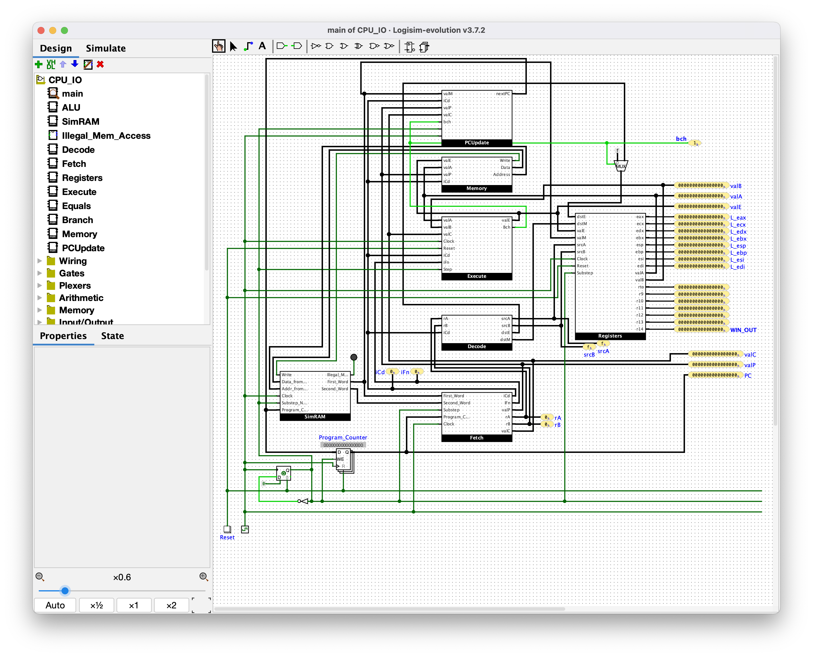

confounded pondering unit [Reversing, 479 points, 14 solves, 11th solver]
========

## Description

>I wrote this flag checker for this CPU I modified, but forgot the ISA. I also forgot the flag. Find it for me?
>
>Flag format is in README, and any letters should be capitalized when submitting.
>
>Author: argonaut0
>
>**Files:**
>
> * [CPU_IO.circ](CPU_IO.circ)
> * [cpu_README.md](cpu_README.md)
> * [flag-checker-v5.bin](flag-checker-v5.bin)

From the challenge's [README](cpu_README.md) file:

>I wrote this flag checker for this CPU I modified, but forgot the ISA. I also forgot the flag. Find it for me?
>
>.circ files open in Logisim Evolution: https://github.com/logisim-evolution/logisim-evolution
>
>The checker will read the flag as a 64-bit hex string at a certain location in memory.
>Flag should be submitted as maple{XXXX_XXXX_XXXXX_XXX} where X is an uppercase hex digit.


## Overview

I started working on this challenge the day after I solved [vm-v2](../vm-1_and_2/README.md). Yet another custom CPU architecture to reverse engineer and learn! I enjoy these types of challenges, so I was determined to solve it.

Unlike vm-v2, which provided you the CPU implemented in SystemVerilog, this challenge provides you a `.circ` file, which is the file type used by Logisim Evolution. Logisim Evolution is a visual circuit designer and simulator. I have never used it before, though I've watched a video or two that use it. After installing Logisim Evolution and opening the challenge file up in it, we are indeed presented with a circuit diagram of a CPU:



After exploring Logisim Evolution for a while, I learned a few useful things:

* You can explore the implementation of different components by double-clicking on the component's name in the Design/Simulate sidebar on the left
* You can add your own probes to any wires to show the live values as it's executing
* You can simulate the entire CPU one clock cycle at a time. Keyboard shortcuts on macOS:
  * Reset the simulation: Command+R
  * Simulate a half-tick (clock goes from high to low or vice versa): Command+T
  * Simulate a full-tick (clock goes high and then low): F9
* You can load the provided memory image into the Simram component by right-clicking on the RAM block in that component and choosing the "Load image..." option


## Strategy for reverse engineering the CPU from its circuit diagrams

I'm sure that this challenge could be solved purely by simulating the CPU a bunch and learning about the code execution as it goes, but I chose to reverse engineer the circuit and understand how the CPU actually works, what registers it has, how instructions are decoded and executed, how memory accesses and branches work, etc. Therefore, I started going through the components in Logisim Evolution and taking notes, in the form of a massive documentation comment and some Python code for an "emulator": [emu_old.py]. Note that this "emulator" is really more of a literal translation from the hardware into Python code without doing any real understanding of how it works. I never actually tried running that "emulator", and instead used that as an easier reference of what the hardware is doing to assist with writing a real emulator.

A lot of the reverse engineering effort came down to counting the inputs to various multiplexers to understand how the opcode value changed the way an instruction executes. There are many multiplexers in the circuit, most of which use a 4-bit selector (so there are 16 inputs, one for each opcode, ALU operation, or condition code). Sometimes, it involved trying to understand what unclear names meant (like `IFn`, which probably was shortened from "instruction function", but a better name might be `aluop_or_cond`).


## Reverse engineering each component from the CPU

Here, I'll provide screenshots of the full component diagram of each component from Logisim Evolution, a short summary of what that component's function is, and some Python pseudocode for how the component works.


### SimRAM


The **SimRAM** component is a wrapper around a RAM block. The RAM is defined as 16M x 16, meaning it holds ~16 million 16-bit words. The output of this components is a 64-bit value (`First_Word`) and a 16-bit value (`Second_Word`). No pseudocode for this one.


### Fetch


This component is confusingly named in my opinion. It is not responsible for fetching an instruction from memory. Rather, it decodes an instruction after it has been fetched from memory. This is extra confusing because there's another component called **Decode**.

This component works by pulling apart the first 16-bit word of the instruction into 4 parts: `opcode`, `func`, `rA`, and `rB`. It also will build `valC` (the `imm64` value, if the instruction is one that uses an immediate, namely `MOVI`, `STR`, `LDR`, `Jcc`, and `CALL`) and calculate the address of the next instruction (`valP`). Note that I use the literal opcode values here rather than using named constants for them. You can refer to the table of instructions further in this writeup to figure out which instructions have which opcode values. Python pseudocode:

```python
MASK64 = 0xffffffffffffffff

# 64-bit first_word: fw
# 16-bit second_word: sw
# iCd = opcode
# IFn = func
def fetch(pc, fw, sw):
	opfunc = fw >> 56
	func = opfunc & 0x0f
	opcode = opfunc >> 4
	regpair = (fw >> 48) & 0xff
	
	# mux1
	if opcode in (0x3, 0x8, 0x9):
		regs = 0xf0 | (regpair & 0x0f)
	elif opcode in (0x2, 0x4, 0x5, 0x6, 0xA, 0xB):
		regs = regpair
	else:
		regs = 0xff
	
	ra = (regs >> 4) & 0xf
	rb = regs & 0xf
	
	# mux2
	if opcode in (0x3, 0x4, 0x5, 0x7, 0x8):
		valC = ((fw << 16) & MASK64) | sw
	else:
		valC = MASK64
	
	# mux3
	if opcode in (0x1, 0x2, 0x6, 0x9, 0xA, 0xB):
		valP = pc + 1
	elif opcode in (0x3, 0x4, 0x5, 0x7, 0x8):
		valP = pc + 5
	else:
		valP = pc + 0
	
	return (opcode, func, ra, rb, valC, valP)
```


### Decode


This component could perhaps be named "RegisterSelect" instead, as its task is to determine which registers should be read from and which registers should be written to. As mentioned before, the **Fetch** component could more accurately be named "Decode", so this is a little confusing. Python pseudocode:

```python
# iCd = opcode
def decode(opcode, ra, rb):
	# mux1
	elif opcode in (0x2, 0x4, 0x6, 0x8, 0xA):
		# BUG: Why is 0x8 here? fetch sets ra to 0xf for opcode 0x8, so srcA can't be used for this instruction...
		srcA = ra
	elif opcode in (0x9, 0xB):
		srcA = rb
	else:
		srcA = 0xF
	
	# mux2
	if opcode in (0x2, 0x4, 0x5, 0x6, 0x7, 0x8, 0x9, 0xA, 0xB):
		srcB = rb
	else:
		srcB = 0xF
	
	# mux3
	if opcode in (0x2, 0x3, 0x6, 0x8, 0x9, 0xA, 0xB):
		dstE = rb
	else:
		dstE = 0xF
	
	# mux4
	if opcode in (0x5, 0xB):
		dstM = ra
	else:
		dstM = 0xF
	
	return (srcA, srcB, dstE, dstM)
```


### Registers


Nothing too crazy to talk about here. Shows that `srcA` and `srcB` (from the output of the **Decode** component) are used to produce the `valA` and `valB` outputs. Also that `valE` (ALU result) and `valM` (memory read result) may be used to write to registers `dstE` and `dstM`, respectively. This is also how I figured out which values for `rA` and `rB` mapped to which named registers. List of register numbers:

```python
R_EAX = 0
R_ECX = 1
R_EDX = 2
R_EBX = 3
R_ESP = 4
R_EBP = 5
R_ESI = 6
R_EDI = 7

R_RTO = 8
R_R9  = 9
R_R10 = 10
R_R11 = 11
R_R12 = 12
R_R13 = 13
R_R14 = 14
```


### Memory


This component is what decides the address for all memory operations, whether it is a memory read or write, and if it's a write, what value should be written to memory. The instructions that will write to memory are therefore: `4` aka `STR`, `8` aka `CALL`, and `A` aka `PUSH`. Python pseudocode:

```python
# iCd = opcode
# valE = e
# valA = a
# valP = p
def memory(opcode, e, a, p):
	# mux1
	if opcode in (0x4, 0x5, 0x8, 0xA):
		# Computed memory address
		addr = e
	elif opcode in (0x9, 0xB):
		# Absolute memory address
		addr = a
	else:
		addr = 0
	
	# mux2
	if opcode in (0x4, 0xA):
		# Write value from register
		data = a
	elif opcode == 0x8:
		# Write nextPC (return address)
		data = p
	else:
		data = None
	
	return (addr, data)
```


### Execute


This is the meat and potatoes of the CPU! It's where the actual computations and logic are performed. Firstly of interest here is that you can see that only opcode `6` aka `alu` will update the `ZF`, `SF`, and `OF` flag registers. You can also see from the multiplexer connected to the `func` input on the `ALU` node that the only opcode that allows controlling the ALU operation is opcode `6` aka `alu`. The other opcodes all use `0` aka `ALU_ADD`, except for opcodes `8` aka `CALL` and `A` aka `PUSH`, which use `1` aka `ALU_SUB` as the ALU operation. That's because they both push to a stack, which works like `sp = sp - 4; *sp = value`. Furthermore, you can see in the first multiplexer (connected to the `aluA` input of the `ALU` component) that there are 4 opcodes that use a hardcoded value for `aluA`: `8` aka `CALL`, `9` aka `RET`, `A` aka `PUSH`, and `B` aka `POP`. That's because each of these perform some stack operation like push/pop, which all involve adjusting the stack pointer up or down by 4 words (64 bits total). There are a bunch of other insights you can gather from this circuit diagram, though I won't list them all. Python pseudocode:

```python
# iCd = opcode
# valA = a
# valB = b
# valC = c
# IFn = func
# bch = should_branch
def execute(opcode, a, b, c, func):
	global zf, sf, of
	
	# mux1 (aluA)
	if opcode in (0x2, 0x6):
		aluA = a
	elif opcode in (0x3, 0x4, 0x5, 0x7):
		aluA = c
	elif opcode in (0x8, 0x9, 0xA, 0xB):
		aluA = 4
	else:
		aluA = 0
	
	# mux2 (aluB)
	if opcode in (0x4, 0x5, 0x6, 0x8, 0x9, 0xA, 0xB):
		aluB = b
	else:
		aluB = 0
	
	# mux3 (aluFunc):
	if opcode == 0x6:
		aluFunc = func
	elif opcode in (0x8, 0xA):
		aluFunc = ALU_SUB
	else:
		aluFunc = ALU_ADD
	
	# Emulate ALU component
	e, z, s, o = alu(aluA, aluB, aluFunc)
	
	# Should set flags?
	if opcode == 0x6:
		zf = z
		sf = s
		of = o
	
	# Emulate Branch component
	should_branch = branch(opcode, zf, sf, of, func)
	return should_branch
```


### ALU


The ALU for this CPU is pretty straightforward. It calculates a bunch of different mathematical operations (depending on the `func` from the instruction), stores the result in `valE`, and updates the values of the flags: `ZF` if the result is zero, `SF` if the result is negative, and `OF` if the computation overflowed (except for `<<`). Python pseudocode:

```python
ALU_ADD = 0x0
ALU_SUB = 0x1
ALU_AND = 0x2
ALU_XOR = 0x3
ALU_MUL = 0x4
ALU_DIV = 0x5
ALU_MOD = 0x6
ALU_SHL = 0x7
ALU_SHR = 0x8

# Mappings from names in Logisim to this Python code:
# aluA = a
# aluB = b
# valE = e
def alu(a, b, func):
	if func == ALU_ADD:
		e = b + a
	elif func == ALU_SUB:
		e = b - a
	elif func == ALU_AND:
		e = b & a
	elif func == ALU_XOR:
		e = b ^ a
	elif func == ALU_MUL:
		e = b * a
	elif func == ALU_DIV:
		e = b / a
	elif func == ALU_MOD:
		e = b % a
	elif func == ALU_SHL:
		e = (b << (a & 0x3f)) & MASK64
	elif func == ALU_SHR:
		e = b >> (a & 0x3f)
	else:
		e = 0
	
	if e & ~MASK64:
		o = True
	else:
		o = False
	
	e &= MASK64
	
	z = not bool(e)
	s = bool(e & (1 << 63))
	
	return (e, z, s, o)
```


### Branch


This component is responsible for deciding whether the condition code in a conditional instruction evaluates to true. A better name for this component might be "Condition". It uses the values of `ZF`, `SF`, and `OF` in some combinatorial logic to output the `Bch` value. Note that `Bch` is true by default, and can only be false when the opcode is either `7` aka `Jcc` or `2` aka `MOV`, and the condition evaluates to false.

>Aside: I didn't actually notice that `MOV` was considered conditional until I was creating this writeup. Based on this new knowledge, `MOV` might be better known as `CMOV` (conditional mov), or using instruction mnemonics like `MOVEQ` (for move if equal). The `Bch` output of this component feeds into both the **PCUpdate** component and a 2-value multiplexer at the top-level, which determines whether the `dstE` input to the **Registers** component is ignored or not. So only for the `MOV` instruction, and when its condition evaluates to false, will the `dstE` input to the **Registers** component be ignored.

Python pseudocode:

```python
# iCd = opcode
# iFn = func
# returns bch
def branch(opcode, z, s, o, func):
	if opcode not in (0x2, 0x7):
		return True
	
	so = s ^ o
	
	if func == COND_LE:
		return z or so
	elif func == COND_LT:
		return so
	elif func == COND_EQ:
		return z
	elif func == COND_NE:
		return not z
	elif func == COND_GE:
		return not so
	elif func == COND_GT:
		return not (z or so)
	else:
		return True
```


### PCUpdate


This component is what decides the value of `PC` that should be used for fetching the next instruction. By looking at the inputs to the multiplexer, it can be seen that all opcodes except for 3 will use `valP`, aka the address of the first word directly after the end of the current instruction. The exceptions:

* Opcode `7` uses `valC` aka `imm64` when `bch` is true, otherwise it uses `valP`. Therefore, this is a condition jump, aka `Jcc`.
* Opcode `8` always uses `valC` aka `imm64`. This is the `CALL` instruction.
* Opcode `9` always uses `valM`, which is the value read from memory. This is the `RET` instruction. I'm not sure why it uses a register to store the `valM` value in this component. If anyone knows, please send me a message!

Python pseudocode:

```python
# valM = m
# valP = p
# valC = c
# iCd = opcode
# bch = should_branch
def pcupdate(m, p, c, opcode, should_branch):
	if opcode == 0x7: #Jcc
		return c if should_branch else p
	elif opcode == 0x8: #CALL
		return c
	elif opcode == 0x9: #RET
		# TODO: The component uses a register. Does this need to be delayed by one cycle?
		return m
```


### Main


To tie everything together, here's how everything is connected.

1. The **SimRAM** component reads 5 16-bit words from RAM.
2. These get passed to the **Fetch** component, which pulls apart the first 16-bit word into the opcode (`iCd`), `func` (`IFn`), `rA`, and `rB`. It may also read an `imm64` value into `valC`. It also computes `valP` as the address of the next word after this instruction.
3. Next, the **Decode** component uses the opcode along with `rA` and `rB` to decide which registers should be read from (`srcA` and `srcB`) and written to (`dstE` and `dstM`).
4. Then, `srcA` and `srcB` are used by the **Registers** component to read the value of these registers as `valA` and `valB`.
5. The **Memory** component will select the address and data for memory operations, as well as whether to read from or write to memory. It instructs the **SimRAM** component on what to do.
6. The **Execute** component will then coordinate inputs and outputs to the **ALU** and **Branch** components, depending on the opcode, and potentially update the `ZF`, `SF`, and `OF` flag registers.
7. The **ALU** component will perform some mathematical operation on the `aluA` and `aluB` operands, returning the result as `valE` and calculating the `ZF`, `SF`, and `OF` flags.
8. The **Branch** component will evaluate the condition (from the `func` field) to set the value of the `bch` signal.
9. The **PCUpdate** component will compute the next value for the program counter (`PC`), which will either be `valP` (for normal instructions or conditional branches that aren't taken because the condition evaluates false), `valC` for jumps like `Jcc` or `CALL`, or `valM` for `RET`.
10. The **Registers** component will also write back up to two different registers during an instruction (such as `POP`). It uses the `dstE` and `dstM` register numbers from the **Decode** component to decide which registers should be written to, and uses `valE` (ALU result) and `valM` (memory read output) as the values for those registers.


## Summary of CPU architecture and instructions

* 64-bit general purpose registers:
  * `eax`, `ecx`, `edx`, `ebx`, `esp`, `ebp`, `esi`, `edi` (yes, they're 64-bit despite being named like `eax` instead of `rax`)
  * `rto`, `r9`, `r10`, `r11`, `r12`, `r13`, `r14`
* 64-bit program counter (`PC`)
* Zero flag (`ZF`), sign flag (`SF`), and overflow flag (`OF`)
* 24-bit memory addresses (for a total of 16M words)
* Shared code and data memory (Von-Neumann architecture)
* Memory is stored as 16-bit words (not byte-addressable)
* Instructions are either 1 or 5 words (depending on if they use an immediate value)
* No dedicated stack register. Each `push`, `pop`, `call`, and `ret` instructions specifies the register to use as its "stack pointer"
* Big-endian memory ordering. For 64-bit memory operations, the first 16-bit word is the most significant.


An instruction can be decoded by looking at a single 16-bit word. The opcode determines which instruction it is. The `func` field is only used by two instructions: `alu` and `Jcc`. `rA` and `rB` are used to select which registers are used by the instructions.

* Bits 15-12: `opcode`
* Bits 11-8: `func`
* Bits 7-4: `rA`
* Bits 3-0: `rB`


| Opcode | Func   | Instruction          | Operation                    |
|-------:|-------:|:---------------------|:-----------------------------|
|    `0` | unused | `HALT`               | `while(1) {}`                |
|    `1` | unused | `NOP`                | `nop`                        |
|    `2` |   cond | `MOVcc b, a`         | `if(cond) b = a`             |
|    `3` | unused | `MOVI b, imm64`      | `b = imm64`                  |
|    `4` | unused | `STR a, [b + imm64]` | `*(b + imm64) = a`           |
|    `5` | unused | `LDR a, [b + imm64]` | `a = *(b + imm64)`           |
|    `6` |  aluOp | `alu b, a`           | `b = aluOp(b, a)`            |
|    `7` |   cond | `Jcc imm64`          | `if(cond) goto imm64`        |
|    `8` | unused | `CALL b, imm64`      | `b.push(nextPC); goto imm64` |
|    `9` | unused | `RET b`              | `goto b.pop()`               |
|    `A` | unused | `PUSH a, [b]`        | `b -= 4; *b = a`             |
|    `B` | unused | `POP a, [b]`         | `a = *b; b += 4`             |
|  `C-F` | unused | Illegal instruction  | Illegal instruction          |


For the `alu` instruction, the `func` field selects which ALU operation should be performed:

| Mnemnoic | Func | Operation    |
|:---------|-----:|:-------------|
| `add`    |  `0` | `b = b + a`  |
| `sub`    |  `1` | `b = b - a`  |
| `and`    |  `2` | `b = b & a`  |
| `xor`    |  `3` | `b = b ^ a`  |
| `mul`    |  `4` | `b = b * a`  |
| `div`    |  `5` | `b = b // a` |
| `mod`    |  `6` | `b = b % a`  |
| `shl`    |  `7` | `b = b << a` |
| `shr`    |  `8` | `b = b >> a` |


For the `Jcc` instruction, the `func` field selects the condition that should be used to determine whether or not the branch should be taken. Note that all the comparisons are signed comparisons.

| Mnemonic | Func  | Condition                      |
|:---------|------:|:-------------------------------|
| `jmp`    |   `0` | Unconditional jump             |
| `jle`    |   `1` | `<=`, aka `ZF \|\| (SF != OF)` |
| `jlt`    |   `2` | `<`, aka `SF != OF`            |
| `jeq`    |   `3` | `==`, aka `ZF`                 |
| `jne`    |   `4` | `!=`, aka `!ZF`                |
| `jge`    |   `5` | `>=`, aka `SF == OF`           |
| `jgt`    |   `6` | `>`, aka `!ZF && (SF == OF)`   |
| `jmp`    | `7-F` | Unconditional jump (again)     |


## Building a disassembler, emulator, and interactive debugger

As with the vm-2 challenge, I decided to write a disassembler, emulator, and interactive debugger for this challenge. I used a lot of the code I wrote for the vm-2 challenge as a framework for this one. My emulator can be found here: [emu.py](emu.py).

>Aside: I didn't actually get the emulator working until about 30 minutes after I solved this challenge. It turns out that I had implemented the `_pop()` function (which is used by both the `POP` and `RET` instructions) incorrectly like so: `sp += 4; value = *sp`. The stack pointer actually needs to be updated _after_ reading the value to pop from it.


## Reverse engineering the assembly program to get the flag!

Now that I fully understood the architecture and had a working disassembler, I created this annotated disassembly listing: [disasm.txt](disasm.txt). The challenge's [README](cpu_README.md) stated:

>The checker will read the flag as a 64-bit hex string at a certain location in memory.

The 5th and 6th instructions can be used to figure out that the flag is loaded from address `F1A9` (lol, "FLAG"):

```python
# Load flag into ecx
14: movi eax, 0xf1a9
19: ldr flag_ecx, [eax + 0x0]
```

Then, the code goes on a huge chain of calling functions, running some code, and returning. It gets really confusing though, because each call and return use one of four different stack pointers: `esp`, `ebp`, `esi`, or `edi`. Therefore, rather than trying to statically determine the program's flow, I opted to dynamically step through the program's execution to see which `PC` values it hits on each clock cycle. As my emulator wasn't working yet, I was actually using the F9 keyboard shortcut in Logisim Evolution to run one full clock cycle at a time. I was watching the **Main** circuit diagram, specifically the probe values on the right for the registers and `PC`.

I also was able to statically determine that the flag value is being validated in four 16-bit chunks using a combination of XOR, subtraction, and bitwise operations. The first block of code for checking one of the flag chunks is here:

```python
# rto = flag ^ 0xb4a55f3e60a41ca1
1F: movi edx, 0xb4a55f3e60a41ca1
24: mov rto, flag_ecx
25: xor rto, edx

# rto = (flag ^ 0xb4a55f3e60a41ca1) - 0x450c0f3e60a41ca1
26: movi ebx, 0x450c0f3e60a41ca1
2B: sub rto, ebx

# rto = ((flag ^ 0xb4a55f3e60a41ca1) - 0x450c0f3e60a41ca1) / 0x1000000000000 == 0
# determines word 1: 0xf1a9
2C: movi edx, 0x1000000000000
31: div rto, edx
32: jne exit
```

I built up the expressions calculated by these instructions and turned the logic into an equation, and then you can just do a bit of algebra to solve for (part of) flag. In this case, `a / 0x1000000000000` is just another way to write `a >> 48`, which means that this code is only operating on the highest 16 bits of the flag. Then, we need to make sure that the high 16 bits of the flag, when XORed against 0xb4a5, and then with 0x450c subtracted from it, is equal to zero. This means that the result of `flag_1 ^ 0xb4a5 == 0x450c`, so therefore `flag_1 = 0xb4a5 ^ 0x450c = 0xf1a9`.

This same logic can be applied to the other three code blocks that check a chunk of the flag. In the end, the flag value ends up being 0xf1a9f33dbac04777, or in the flag format specified in the challenge's README, `maple{F1A9_F33D_BAC04_777}` (flag feed bacon 777). I was able to confirm whether each chunk of the flag was correct or incorrect by stepping through the program and seeing whether the `jne exit` branch for each chunk is taken or skipped. Also, after each block of code checks one of the words of the flag, it then writes to the same word position in the `R14` register with the value `0xf1a9`. So when you get the correct flag and the program terminates, the value of `R14` (which is labeled as `WIN_OUT` in the Logisim Evolution circuit diagram) will be 0xf1a9f1a9f1a9f1a9.


## Conclusion

This was a very different challenge for me! I have never used Logisim before, nor have I ever tried to reverse engineer any form of circuit diagram (especially for a CPU!). Though I will say that I never imagined I would spend so much time counting the input legs on multiplexers before haha. Good challenge, and I'm glad I worked on it and solved it during the competition!
